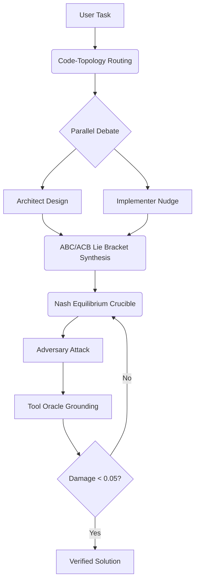

# SAGE-CODE Architecture

SAGE-CODE is an adversarially-hardened coding assistant that leverages the 192 GB HBM3 capacity of the AMD MI300X to run four specialized agents co-resident.

## The Specialist Agents

- **ARCHITECT** (Qwen2.5-Coder-32B): Defines API contracts and invariants.
- **IMPLEMENTER** (DeepSeek-Coder-V2-Lite): Writes idiomatic code bodies.
- **SYNTHESIZER** (Qwen2.5-Coder-72B): Resolves design conflicts and merges branches.
- **RED-TEAM** (Adversary Ensemble): Finds bugs and security flaws grounded by real tools.

## The AODE Coding Loop

## Tool Grounding (The Oracle)

Unlike vanilla RAG systems, SAGE-CODE is grounded by:
- **Static Analysis**: ruff, mypy, bandit, semgrep.
- **Dynamic Analysis**: pytest in firejail-sandboxed subprocesses.
- **Complexity**: radon cyclomatic complexity and maintainability index.
