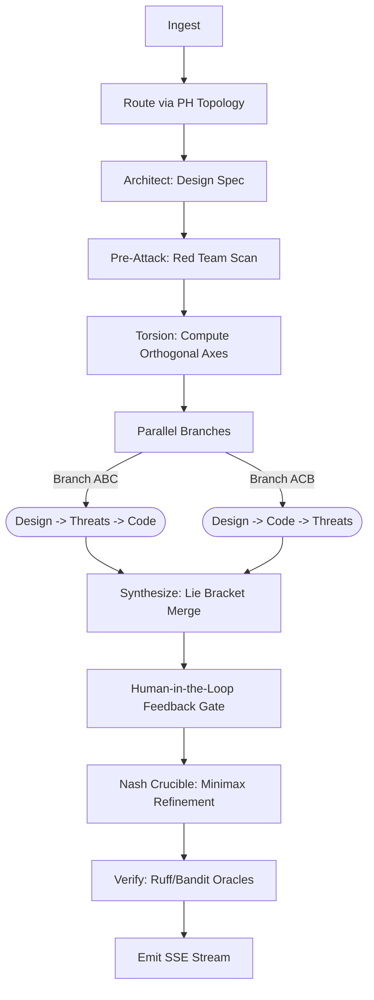

# SAGE-PRO: Axiomatic Orthogonal Divergence Engine (AODE)
**Version:** 2.0.0
**Architecture:** 4-Agent LangGraph Ensemble
**Target Infrastructure:** AMD Instinct™ MI300X (192 GB HBM3)

---

## 1. Executive Summary

SAGE-PRO is a research-grade, self-evolving LLM orchestration engine. It transcends standard "chat-with-code" wrappers by employing a multi-agent architectural pipeline grounded in topological void detection, adversarial pressure testing, and non-abelian concept synthesis. 

Designed natively for the **AMD Instinct™ MI300X**, SAGE-PRO utilizes a 4-agent LangGraph council (Architect, Implementer, Synthesizer, Red-Team) that enforces divergence over consensus. Instead of averaging mediocre outputs, the system forces agents down mathematically orthogonal reasoning paths and resolves their differences using a game-theoretic Nash Crucible.

## 2. The 6 Pillars of Novelty

SAGE-PRO implements six foundational systems that distinguish it from industry-standard orchestrators:

1. **Persistent Homology Void Detection:** Rather than relying on semantic similarity (Cosine/Dot), SAGE uses Betti numbers (Persistent Homology) to detect "topological voids" in the code manifold, identifying edge cases the user didn't even know existed.
2. **Execution Trace Embeddings:** A 3-layer hasher (AST structural hash + stack trace hash + state signature) clusters failure modes by their structural shape, bypassing superficial text descriptions.
3. **Dynamic Agent Spawner:** An autonomous watcher that monitors the Q-table. If a specific cluster of tasks repeatedly fails, it synthesizes a new specialist agent, injects it into the registry, and wires it into the LangGraph in real-time.
4. **Adversarial Latent Perturbations:** The Red-Team model mathematically perturbs query vectors toward known high-penalty centroids, forcing the system to defend against real past failure modes before generating a response.
5. **AST Diff Reward Crystallizer:** Replaces subjective LLM-as-a-Judge feedback with deterministic delta scoring (Levenshtein distance of Abstract Syntax Trees), providing mathematically grounded RLHF signals.
6. **Topological Self-Play (Chaos Curriculum):** An autonomous "Chaos Monkey" that injects subtle edge-case bugs into the codebase during downtime, forcing the agent council to fix them to continuously pre-train the Q-table.

## 3. The LangGraph Pipeline

The system is orchestrated via a 10-node **LangGraph StateGraph** pipeline:

### The Human-in-the-Loop (HitL) Checkpoint
SAGE-PRO utilizes LangGraph's native `interrupt_after` capability paired with a `MemorySaver` checkpointer. After synthesis, the graph suspends execution. This allows the Gradio frontend to inject asynchronous user feedback (Artifact Comments) directly into the agent's context window mid-stream, dynamically altering the trajectory of the final Crucible refinement.

## 4. The Agent Council

The system leverages Ollama to run specialized open-weight models concurrently:

*   **Architect (`qwen2.5:72b`)**: Defines the foundational spec, identifies the emotional subtext of the user, and sets the tone directive.
*   **Implementer (`qwen2.5-coder:32b`)**: Generates the concrete code. Executes twice in parallel under different "torsion" constraints (e.g., OOP vs. Functional) to guarantee divergent output.
*   **Synthesizer (`codellama:34b`)**: Fuses the divergent branches. Driven by Lie Bracket non-abelian logic (`[[P,R],V] ≠ [[P,V],R]`), it selects the strongest components of each branch without averaging them.
*   **Red Team (`deepseek-coder-v2:16b` & `deepseek-r1:32b`)**: A dual-model adversarial ensemble that attacks the code via a primary (creative, high-temp) and secondary (methodical, low-temp) pass. Emotional safety is treated as a P0 vulnerability equal to a remote code execution.

## 5. The Minimax Nash Crucible

The final node of the pipeline is the **Crucible**. It implements a two-player zero-sum iterative game between the Synthesizer (Blue) and Red Team (Red).

Each cycle is a round of best-response dynamics: Red attacks, Blue fixes, and the damage is grounded by deterministic oracles (Ruff, Bandit, Pytest). The loop utilizes an **exponential time-decay factor (`e^{-δi}`)**. Following the theorems of Robinson (1951) and Brown (1951), this exponential discounting guarantees that the fictitious play will converge to an approximate minimax Nash Equilibrium in finite cycles, preventing infinite loops.

## 6. Live Streaming Telemetry

The API layer utilizes Starlette's `EventSourceResponse` coupled with LangGraph's `.astream()` asynchronous generator. This provides true Server-Sent Events (SSE) streaming to the frontend.

As the LangGraph nodes execute, the `stream_endpoint` extracts real-time telemetry (VRAM peak usage, Nash cycle counts, Divergence indices, and XAI Traces) and pushes it to the Gradio dashboard, creating a cinematic, live-updating window into the AI's reasoning process.

## 7. AMD MI300X Optimizations

The system is configured to saturate the 192GB HBM3 memory of the AMD Instinct MI300X:
*   **Ollama Multi-Model Residency**: `OLLAMA_MAX_LOADED_MODELS=4` keeps all agents instantly accessible.
*   **Parallel Processing**: The `parallel_branches` node and the dual-model Red Team node utilize `asyncio.gather` to spike GPU utilization and reduce latency.
*   **Flash Attention**: Hardware-accelerated context windowing enables the processing of massive repository traces without memory fragmentation (`OLLAMA_FLASH_ATTENTION=1`).
